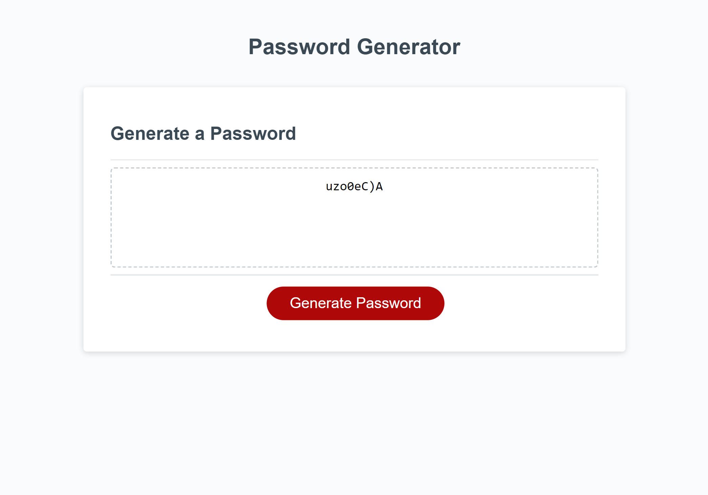

# Password Generator Starter Code
This assignment got us writing javascript code which made an interactive, password generating webpage. My cited sources are listed below.

# Cited Sources
1. https://dev.to/code_mystery/random-password-generator-using-javascript-6a -syntax help

2. https://stackoverflow.com/questions/1497481/javascript-password-generator -for loop for generator function

3. https://git.bootcampcontent.com/Washington-University-in-St.-Louis/WUSTL-VIRT-FSF-PT-01-2023-U-LOLC 

4. https://www.youtube.com/watch?v=x4HUaiazDes 

5. https://www.youtube.com/watch?v=v2jfGo7ztm8 - this source walked me through every part of the script.js(scr.js for this repo)

6. https://github.com/coding-boot-camp/friendly-parakeet - starter code!